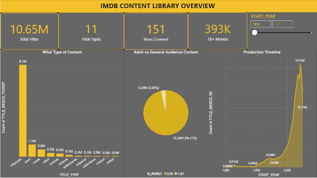
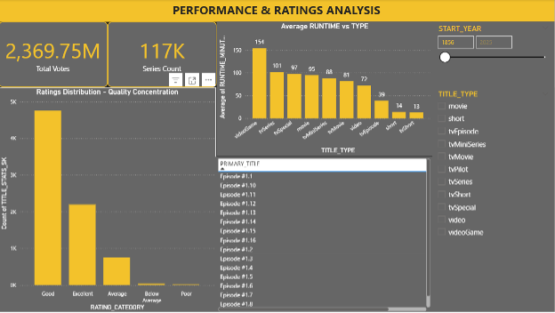
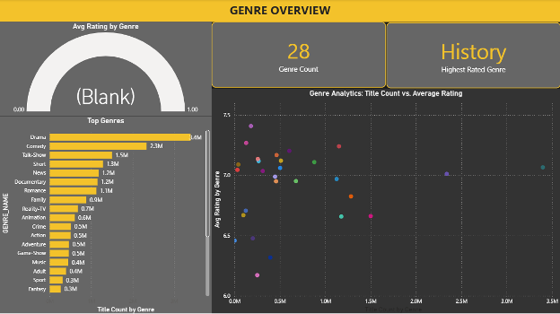
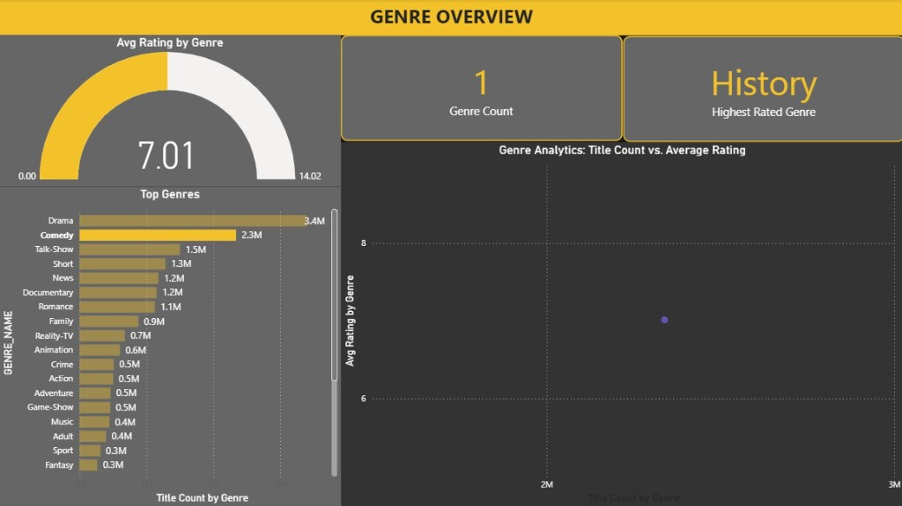
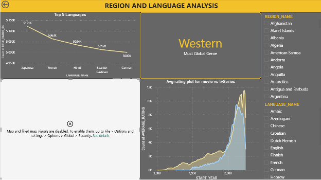
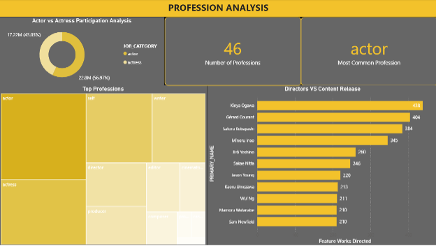

# IMDb Analytics & Data Warehouse Platform

An end-to-end data engineering and BI project that transforms raw IMDb datasets into a governed analytics warehouse and an interactive Power BI dashboard. The solution follows a Bronze, Silver, and Gold medallion architecture using Databricks, Delta Live Tables, Snowflake, Alteryx, and Power BI.

## Project Highlights

- Built a scalable IMDb analytics pipeline across title, ratings, episode, crew, principal, region, language, genre, and profession data.
- Implemented Bronze and Silver processing in Databricks notebooks with schema standardization, metadata capture, null handling, deduplication, and derived fields.
- Designed a Snowflake Gold layer with dimensional tables, bridge tables, and fact tables optimized for BI reporting.
- Created Power BI dashboards for content library exploration, ratings performance, genre trends, region and language analysis, and profession participation.
- Documented profiling, data cleaning, dimensional modeling, and dashboard design artifacts in the repository.

## Business Use Cases

This platform helps answer questions such as:

- What content types dominate the IMDb catalog?
- Which genres and regions produce highly rated titles?
- How do title volume, votes, and ratings trend over time?
- How do movies compare with TV series across runtime, ratings, and release patterns?
- Which professions, actors, actresses, writers, and directors contribute most to the catalog?

## Dashboard Preview

### Content Library Overview



The overview page summarizes total titles, content types, years covered, adult-content distribution, and production timeline trends.

### Performance and Ratings Analysis



This page focuses on voting volume, series count, rating concentration, average runtime by title type, and title-level drilldowns.

### Genre Overview



The genre view compares top genres by title count, average rating by genre, genre count, and rating distribution against volume.

### Genre Drilldown



The filtered genre page shows how slicers change the genre count, highest-rated genre, average rating gauge, and title-count distribution.

### Region and Language Analysis



This report explores global content distribution by region and language, including top languages and movie versus TV-series rating trends.

### Profession Analysis



The profession page analyzes actor and actress participation, top professions, and directors by feature works directed.

## System Architecture

```text
IMDb Source Files
        |
        v
Bronze Layer - Databricks / Delta Live Tables
Raw ingestion, schema hints, source metadata, ingestion timestamps
        |
        v
Silver Layer - Databricks / PySpark
Cleaned columns, typed fields, null handling, deduplication, normalization
        |
        v
Gold Layer - Snowflake
Dimensional model, bridge tables, fact tables, surrogate keys
        |
        v
Power BI Semantic Model
Relationships, measures, filters, slicers, aggregations
        |
        v
Interactive BI Dashboards
Executive and analyst-ready reporting
```

## Data Pipeline Design

### Bronze Layer

The Bronze layer ingests IMDb source datasets into Databricks with minimal transformation. It preserves raw data while adding ingestion metadata such as source file path, ingestion date, and timestamp.

Key responsibilities:

- Read raw IMDb data files into structured Bronze tables.
- Apply schema hints for consistent ingestion.
- Preserve source lineage and ingestion metadata.
- Keep data close to the original source for traceability.

### Silver Layer

The Silver layer standardizes and cleans the raw IMDb data. Transformations include column renaming, trimming, type casting, null handling, duplicate removal, and derived analytical fields.

Key responsibilities:

- Normalize IMDb source fields into business-friendly column names.
- Clean missing values such as unknown genres, professions, languages, and regions.
- Standardize data types for years, runtime, ratings, votes, and ordering fields.
- Prepare conformed datasets for dimensional modeling.

### Gold Layer

The Gold layer models the cleaned data in Snowflake for analytics. It uses dimensional modeling patterns with surrogate keys, dimensions, facts, and bridge tables for many-to-many relationships.

Key responsibilities:

- Build dimensions for titles, people, genres, professions, jobs, regions, languages, and alternate titles.
- Build bridge tables for title-to-genre and person-to-profession relationships.
- Build fact tables for title statistics and title participation.
- Optimize the model for Power BI slicing, filtering, and aggregation.

## Gold Data Model

### Dimensions

- `DIM_TITLE_BASICS` stores title metadata such as title type, primary title, original title, adult flag, years, runtime, and genre string.
- `DIM_PERSON` stores person-level IMDb information.
- `DIM_GENRE` stores unique genre values exploded from title data.
- `DIM_PROFESSION` stores unique profession values exploded from person data.
- `DIM_JOB` stores job and category values from title principals.
- `DIM_REGION` stores regional codes and names.
- `DIM_LANGUAGE` stores language codes and names.
- `DIM_TITLE_AKAS` stores alternate titles with region and language relationships.

### Bridge Tables

- `BRIDGE_TITLE_GENRE` resolves the many-to-many relationship between titles and genres.
- `BRIDGE_PERSON_PROFESSION` resolves the many-to-many relationship between people and professions.

### Fact Tables

- `FACT_TITLE_STATS` supports ratings, votes, episode, season, and title-level analytics.
- `FACT_TITLE_PARTICIPATION` supports cast, crew, profession, job, and participation analysis.

## Technology Stack

### Data Engineering

- Databricks
- Delta Live Tables
- PySpark
- Snowflake
- Alteryx

### Data Modeling and Warehousing

- Medallion architecture
- Dimensional modeling
- Star schema design
- Surrogate keys
- Fact and dimension tables
- Bridge tables for many-to-many relationships

### BI and Analytics

- Power BI
- Dashboard design
- Data storytelling
- KPI cards, slicers, filters, bar charts, line charts, gauge visuals, treemaps, and scatter plots

### Programming and Tools

- Python
- SQL
- Git and GitHub
- Jupyter / Databricks notebooks

## Repository Structure

```text
.
|-- README.md
|-- Bronze_Silver_IMDB*.ipynb                  # Bronze and Silver Databricks pipeline notebooks
|-- IMDB_Bronze_Silver.ipynb                   # Bronze/Silver transformation notebook
|-- IMDB_SILVER_2_SNOWFLAKE.ipynb              # Silver to Snowflake loading workflow
|-- IMDB_SILVER_2_GOLD(SNOWFLAKE)*.ipynb       # Gold layer dimensional modeling notebooks
|-- title.Basics.yxmd                          # Alteryx workflow for title basics
|-- Title.Crew  alteryx.yxmd                   # Alteryx workflow for title crew
|-- IMDB_DATAMODEL_updated 1 (1) 1.DM1         # Data model artifact
|-- IMDB_Data Cleaning_DOC.pdf                 # Data cleaning documentation
|-- IMDB_Project_Profiling*.pdf                # Profiling reports
|-- Final_Project_Profiling*.docx              # Profiling documentation
`-- assets/dashboard/                          # Dashboard screenshots used in this README
```

## Dataset Scope

The project uses IMDb datasets covering:

- Title basics
- Title ratings
- Title episodes
- Title principals
- Title crew
- Title alternate names / AKAs
- Name basics
- Region reference data
- Language reference data

The dashboard currently reports over 10M titles, 151 years of content history, and large-scale vote and rating aggregates.

## Key Engineering Decisions

- Used a medallion architecture to separate raw ingestion, cleaned data, and analytics-ready modeling.
- Added ingestion metadata in Bronze to improve lineage and troubleshooting.
- Standardized Silver columns before warehouse loading to keep the Gold model consistent.
- Used surrogate keys in Gold dimensions to support clean relationships in BI.
- Used bridge tables for multi-value fields such as genres and professions.
- Loaded curated Gold tables into Snowflake for reporting performance and BI compatibility.

## How to Use This Project

1. Review the Bronze and Silver notebooks to understand raw ingestion and cleaning logic.
2. Run the Databricks notebooks to create Bronze and Silver tables.
3. Run the Silver-to-Snowflake and Gold-layer notebooks to publish dimensions, bridge tables, and fact tables.
4. Connect Power BI to the Snowflake Gold schema.
5. Recreate or refresh the dashboard pages using the screenshots and model documentation as references.

## Project Deliverables

- Bronze and Silver Databricks notebooks
- Snowflake Gold layer transformation notebooks
- Alteryx workflow files
- Data profiling and cleaning documentation
- Dimensional data model artifact
- Power BI dashboard screenshots
- Clean project README and architecture documentation

## Author

**Paramjeet Singh**  
MS in Information Systems, Northeastern University  
Data Engineer | AI Engineer | Analytics Engineer

- Email: paramjeetsingh070@gmail.com
- LinkedIn: <https://www.linkedin.com/in/paramjeet5ingh>
- Portfolio: <https://www.paramjeetsingh.me>
